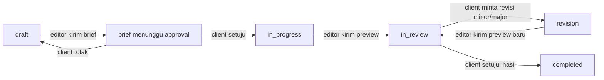
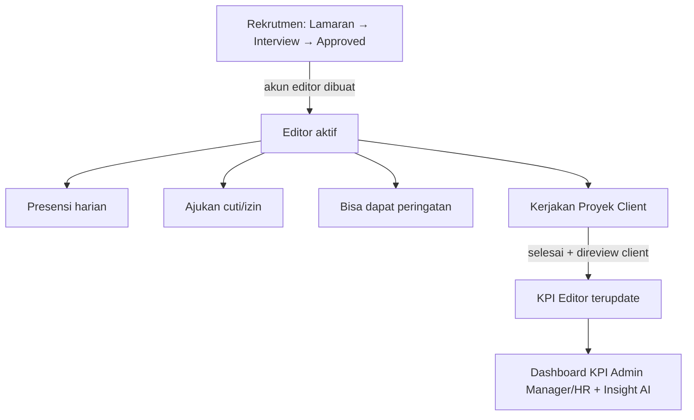

# WORKFLOW — Alur Proses Bisnis Manava

Dokumen ini menjelaskan alur kerja **yang benar-benar berjalan di aplikasi** (bukan hanya rencana di `prd.md`), per modul, secara ringkas. Setiap langkah menyebutkan aktor (siapa yang melakukan) dan status yang berubah, supaya logikanya mudah dijelaskan ulang.

## 1. Peran Pengguna (Role)

| Role | Fungsi utama |
|---|---|
| `superadmin` | Akses penuh, bisa bertindak sebagai HR/AM bila perlu |
| `hr_admin` | Rekrutmen, presensi, cuti (approve level AM), peringatan, payroll (data) |
| `admin_manager` | Kepala departemen: approve cuti editor, beri peringatan, pantau KPI tim |
| `editor` | Mengerjakan proyek klien, presensi, ajukan cuti |
| `client` | Booking editor, brief proyek, review hasil, minta revisi |

Satu departemen = 1 admin_manager + 10 editor (5 departemen: Photo Retouching, Video Editing, Color Grading, Motion Graphics, VFX & Compositing).

---

## 2. Rekrutmen Editor

**Aktor: Client publik (pelamar) → HR Admin**

```
1. Pelamar isi form lamaran publik (CV) → status: New
2. Sistem AI membaca CV → skor kecocokan + rekomendasi departemen (otomatis, saat submit)
3. HR undang interview → status: Interview (email otomatis terkirim)
4. HR putuskan:
   a. Approve → pilih departemen final → status: Approved
      → SISTEM OTOMATIS buat akun editor + kirim kredensial via email
   b. Reject (bisa dari New atau Interview) → status: Rejected
```

- Hanya 4 status: `New → Interview → Approved/Rejected` (disederhanakan dari pipeline lama).
- Akun editor baru otomatis aktif dan langsung bisa login (password default, wajib ganti saat login pertama).

---

## 3. Booking & Kontrak Proyek (inti bisnis)

**Aktor: Client ↔ Editor**

```
1. Client booking editor  → Project status: draft (ruang diskusi/chat dibuat)
2. Editor kirim Brief (judul, deskripsi, harga, batas revisi minor) → Contract: pending_client_approval
3. Client jawab brief:
   a. Tolak → Contract: rejected → Project kembali ke draft (editor bisa kirim brief baru)
   b. Setuju → Contract: active → Project: in_progress
      → Revision Envelope dibuat (batas revisi minor + scope included/excluded)
      → DP & sisa pembayaran dihitung (50/50) — tercatat di project, belum ada gateway pembayaran aktif
4. Editor kerjakan proyek, kirim preview (deliverable) → Project: in_review
5. Client di tahap in_review:
   a. Minta revisi → lihat bagian 4
   b. Setujui hasil akhir → Project: completed → Client bisa beri review/rating (masuk ke KPI editor)
```

**Diagram status Project:**



---

## 4. Revisi & Klasifikasi AI

**Aktor: Client minta → AI klasifikasi → Editor kerjakan ulang**

```
1. Client tulis permintaan revisi (hanya bisa saat status in_review)
2. AI klasifikasikan teks permintaan → minor / major / uncertain
   (pakai konteks scope "included/excluded" dari Revision Envelope)
3. Hasil klasifikasi menentukan status revisi:
   - minor    → langsung "accepted", potong 1 jatah allowance gratis
   - major    → "awaiting_topup" (harga tambahan didiskusikan lewat chat, manual)
   - uncertain→ "submitted" (perlu ditinjau manual, belum ada UI mediator khusus)
4. Jika jatah allowance minor sudah habis → sistem tolak revisi baru, minta selesaikan
   proyek atau nego revisi berbayar
5. Editor kirim preview baru → Project kembali ke in_review (siklus berulang ke langkah di atas)
```

---

## 5. Presensi (Attendance)

**Aktor: HR Admin (buka sesi) → semua staf (isi kode)**

```
1. HR "Buka Presensi" pagi (sesi masuk) dan sore (sesi keluar) → sistem generate kode 6 karakter,
   berlaku selama durasi tertentu (default 45 menit)
2. Staf clock-in / clock-out dengan memasukkan kode yang aktif
3. Status harian dihitung otomatis: present / late / absent / leave
4. Jika staf lupa clock-out → status: incomplete, review: pending
   → staf ajukan penjelasan + usulan jam keluar
   → HR putuskan: approved (jam disesuaikan) atau rejected (dihitung absent)
```

---

## 6. Cuti & Izin (Leave)

**Aktor: Editor/Admin Manager ajukan → atasan 1 level di atas approve**

```
1. Editor/Admin Manager ajukan cuti atau izin (tanggal mulai–selesai) → status: pending
2. Routing approval (naik satu tingkat, bukan lintas departemen):
   - requester = editor          → yang approve = admin_manager
   - requester = admin_manager   → yang approve = hr_admin
3. Atasan approve → status: approved (tanggal tsb otomatis tercatat "leave" di presensi)
   atau reject → status: rejected
```

---

## 7. Peringatan Kerja (Warning)

**Aktor: HR/Admin Manager beri peringatan → target boleh akui sendiri**

```
1. HR atau Admin Manager buat peringatan ke editor/admin_manager (alasan + tingkat:
   ringan/sedang/berat) → status: aktif
2. Pemilik peringatan bisa mengakui sendiri → status: diakui
3. Peringatan otomatis dianggap kedaluwarsa setelah tanggal expires
4. Notifikasi masuk ke lonceng notifikasi target user
```

---

## 8. KPI & Evaluasi Kinerja

**Aktor: sistem (otomatis harian/bulanan) → dilihat oleh Editor/Admin Manager/HR**

```
KPI Editor = rata-rata dari:
  - Rating klien (dari review setelah project completed)
  - Completion rate (proyek selesai tepat waktu)
  - Rating manager (input admin_manager, kualitatif per periode)

1. Snapshot KPI dihitung per bulan, per editor, per departemen
2. Dashboard Admin Manager & HR menampilkan tren KPI departemen + insight AI (rekomendasi
   tindakan, dibuat on-demand lewat tombol "minta insight AI")
3. Editor melihat skor KPI pribadi + insight AI personal di ESS (Employee Self-Service)
```

---

## 9. Yang Ada di Data Model Tapi Belum Jadi Alur Aktif di Aplikasi

Supaya tidak membingungkan saat presentasi — bagian ini **ada di skema database dan data demo**, tapi **belum ada tombol/endpoint nyata** yang menjalankannya di aplikasi (masih tahap desain/data siap, alur kerja belum diimplementasi):

| Fitur | Status di skema | Status di aplikasi |
|---|---|---|
| Escrow (tahan dana DP/final) | Ada tabel `EscrowAccount`, `Transaction` | Nilai DP/final dihitung, tapi tidak ada proses hold/release nyata |
| Sengketa (Dispute) & mediator | Ada tabel `Dispute` + enum status | Belum ada endpoint/role mediator aktif menangani sengketa |
| Payroll / slip gaji | Ada tabel `Payslip` | Belum ada endpoint generate slip gaji dari aplikasi |

Data contoh untuk ketiganya **hanya ada karena diisi lewat seed data demo** (untuk kebutuhan visual saat presentasi), bukan hasil proses nyata di aplikasi.

---

## 10. Ringkasan Alur Antar Modul


